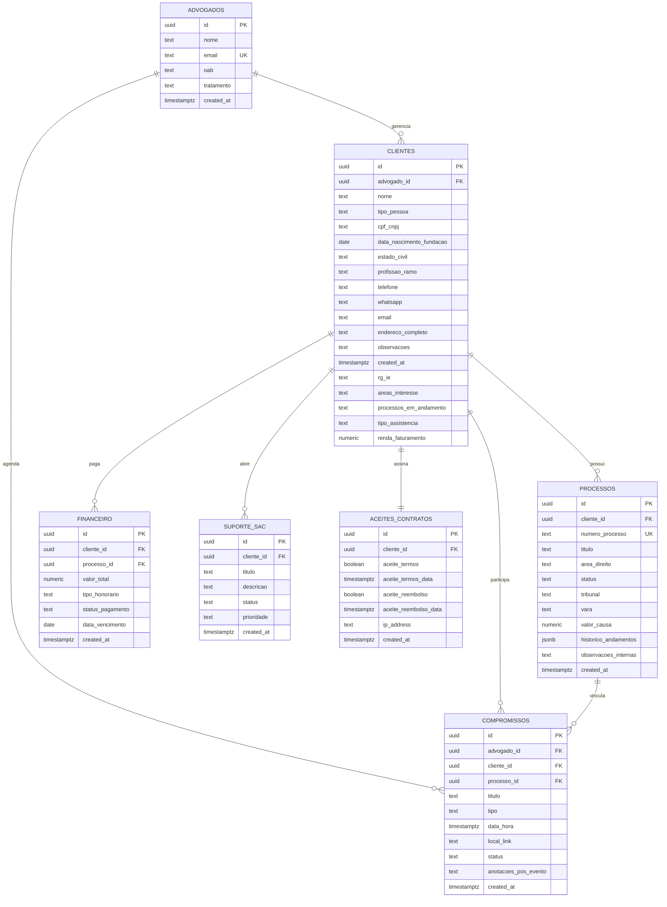

# Documentação do Banco de Dados - JT Advocacia

Este documento descreve a estrutura física do banco de dados relacional e as regras de segurança implementadas para o sistema de gestão jurídica **JT Advocacia** no Supabase.

---

## 📐 Visão Geral da Arquitetura

O banco de dados foi construído com foco em **integridade referencial**, **segurança a nível de linha (RLS)** e **desempenho**. Todas as chaves primárias são geradas dinamicamente usando UUIDs seguros (`gen_random_uuid()`), e as datas e horas utilizam a tipagem recomendada `TIMESTAMP WITH TIME ZONE` para evitar problemas com fusos horários.



---

## 🗂️ Estrutura das Tabelas

### 1. Tabela `advogados`
Contém as credenciais e dados profissionais dos advogados do escritório.

| Nome do Campo | Tipo de Dado | Restrições | Descrição |
| :--- | :--- | :--- | :--- |
| `id` | `UUID` | `PRIMARY KEY`, `DEFAULT gen_random_uuid()` | Identificador único do advogado. |
| `nome` | `TEXT` | `NOT NULL` | Nome completo do advogado (ex: Janaina Tarabauca). |
| `email` | `TEXT` | `NOT NULL`, `UNIQUE` | E-mail para login e contato do advogado. |
| `oab` | `TEXT` | - | Número de registro da OAB e UF. |
| `tratamento` | `TEXT` | `DEFAULT 'Dr(a).'` | Título de tratamento de gênero do advogado ('Dr.' ou 'Dra.'). |
| `created_at` | `TIMESTAMPTZ` | `NOT NULL`, `DEFAULT now()` | Data de criação do perfil do advogado. |

---

### 2. Tabela `clientes`
Armazena as informações dos clientes do escritório. Cada cliente está vinculado a um advogado específico.

| Nome do Campo | Tipo de Dado | Restrições | Descrição |
| :--- | :--- | :--- | :--- |
| `id` | `UUID` | `PRIMARY KEY`, `DEFAULT gen_random_uuid()` | Identificador único do cliente. |
| `advogado_id` | `UUID` | `NOT NULL`, `REFERENCES advogados(id) ON DELETE CASCADE` | Advogado responsável pelo cliente. |
| `nome` | `TEXT` | `NOT NULL` | Nome ou Razão Social do cliente. |
| `tipo_pessoa` | `TEXT` | `CHECK (tipo_pessoa IN ('PF', 'PJ'))` | Tipo de pessoa: 'PF' (Física) ou 'PJ' (Jurídica). |
| `cpf_cnpj` | `TEXT` | - | CPF ou CNPJ do cliente. |
| `data_nascimento_fundacao` | `DATE` | - | Data de nascimento (PF) ou data de fundação (PJ). |
| `estado_civil` | `TEXT` | - | Estado civil do cliente. |
| `profissao_ramo` | `TEXT` | - | Profissão (PF) ou Ramo de Atuação (PJ). |
| `telefone` | `TEXT` | - | Telefone de contato. |
| `whatsapp` | `TEXT` | - | Número de WhatsApp. |
| `email` | `TEXT` | - | E-mail para contato direto. |
| `endereco_completo` | `TEXT` | - | Endereço completo para correspondência. |
| `observacoes` | `TEXT` | - | Notas gerais ou histórico sobre o cliente. |
| `rg_ie` | `TEXT` | - | RG (PF) ou Inscrição Estadual (PJ). |
| `areas_interesse` | `TEXT` | - | Áreas de interesse jurídico selecionadas. |
| `processos_em_andamento` | `TEXT` | - | Listagem de números/tribunais dos processos externos. |
| `tipo_assistencia` | `TEXT` | - | Tipo de assistência (Consultoria, Contencioso, etc.). |
| `renda_faturamento` | `NUMERIC` | - | Renda estimada (PF) ou Faturamento médio (PJ). |
| `created_at` | `TIMESTAMPTZ` | `NOT NULL`, `DEFAULT now()` | Data de criação do cliente no sistema. |

---

### 3. Tabela `processos`
Contém todas as ações judiciais vinculadas a um determinado cliente.

| Nome do Campo | Tipo de Dado | Restrições | Descrição |
| :--- | :--- | :--- | :--- |
| `id` | `UUID` | `PRIMARY KEY`, `DEFAULT gen_random_uuid()` | Identificador único do processo. |
| `cliente_id` | `UUID` | `NOT NULL`, `REFERENCES clientes(id) ON DELETE CASCADE` | Cliente titular da ação jurídica. |
| `numero_processo` | `TEXT` | `UNIQUE` | Número único do processo (Padrão CNJ). |
| `titulo` | `TEXT` | `NOT NULL` | Título resumo da ação (ex: Ação Indenizatória). |
| `area_direito` | `TEXT` | - | Área jurídica (ex: Civil, Trabalhista, Previdenciário). |
| `status` | `TEXT` | - | Status da ação (ex: Ativo, Suspenso, Arquivado, Em Acordo). |
| `tribunal` | `TEXT` | - | Tribunal onde tramita (ex: TJSP, TRT2, JFSP). |
| `vara` | `TEXT` | - | Vara específica do julgamento (ex: 2ª Vara Cível). |
| `valor_causa` | `NUMERIC` | - | Valor econômico atribuído à causa. |
| `historico_andamentos` | `JSONB` | `DEFAULT '[]'::jsonb` | Linha do tempo estruturada de atualizações processuais. |
| `observacoes_internas` | `TEXT` | - | Anotações restritas para a equipe jurídica. |
| `created_at` | `TIMESTAMPTZ` | `NOT NULL`, `DEFAULT now()` | Data de registro do processo no sistema. |

---

### 4. Tabela `compromissos`
Agenda unificada de audiências, prazos, reuniões e atendimentos do escritório.

| Nome do Campo | Tipo de Dado | Restrições | Descrição |
| :--- | :--- | :--- | :--- |
| `id` | `UUID` | `PRIMARY KEY`, `DEFAULT gen_random_uuid()` | Identificador único do compromisso. |
| `advogado_id` | `UUID` | `NOT NULL`, `REFERENCES advogados(id) ON DELETE CASCADE` | Advogado responsável pela agenda. |
| `cliente_id` | `UUID` | `REFERENCES clientes(id) ON DELETE SET NULL` | Cliente associado ao evento (opcional). |
| `processo_id` | `UUID` | `REFERENCES processos(id) ON DELETE SET NULL` | Processo judicial vinculado (opcional). |
| `titulo` | `TEXT` | `NOT NULL` | Título do compromisso. |
| `tipo` | `TEXT` | - | Tipo do evento (ex: Audiência, Reunião, Prazo, Atendimento). |
| `data_hora` | `TIMESTAMPTZ` | `NOT NULL` | Data e horário agendados (com fuso horário). |
| `local_link` | `TEXT` | - | Endereço físico ou link da chamada (Teams/Zoom). |
| `status` | `TEXT` | - | Status do compromisso (ex: Agendado, Realizado, Cancelado). |
| `anotacoes_pos_evento` | `TEXT` | - | Relatório ou ata pós-realização do compromisso. |
| `created_at` | `TIMESTAMPTZ` | `NOT NULL`, `DEFAULT now()` | Data de inserção do compromisso no sistema. |

---

### 5. Tabela `financeiro`
Lançamento de honorários cobrados, acompanhamento de status de vencimento e valores devidos por clientes.

| Nome do Campo | Tipo de Dado | Restrições | Descrição |
| :--- | :--- | :--- | :--- |
| `id` | `UUID` | `PRIMARY KEY`, `DEFAULT gen_random_uuid()` | Identificador único do lançamento. |
| `cliente_id` | `UUID` | `NOT NULL`, `REFERENCES clientes(id) ON DELETE CASCADE` | Cliente pagador do honorário. |
| `processo_id` | `UUID` | `REFERENCES processos(id) ON DELETE SET NULL` | Processo associado ao honorário (opcional). |
| `valor_total` | `NUMERIC` | `NOT NULL`, `CHECK (valor_total >= 0)` | Valor financeiro do honorário lançado. |
| `tipo_honorario` | `TEXT` | `NOT NULL`, `CHECK (tipo_honorario IN ('fixo', 'mensal', 'êxito'))` | Modelo de honorário contratado. |
| `status_pagamento` | `TEXT` | `NOT NULL`, `CHECK (status_pagamento IN ('pago', 'pendente'))` | Estado do pagamento do honorário. |
| `data_vencimento` | `DATE` | `NOT NULL` | Data limite acordada para o vencimento do pagamento. |
| `created_at` | `TIMESTAMPTZ` | `NOT NULL`, `DEFAULT now()` | Data de criação do lançamento financeiro. |

---

### 6. Tabela `suporte_sac`
Armazena os chamados de suporte ao consumidor (SAC) abertos pelos clientes.

| Nome do Campo | Tipo de Dado | Restrições | Descrição |
| :--- | :--- | :--- | :--- |
| `id` | `UUID` | `PRIMARY KEY`, `DEFAULT gen_random_uuid()` | Identificador único do chamado. |
| `cliente_id` | `UUID` | `NOT NULL`, `REFERENCES clientes(id) ON DELETE CASCADE` | Cliente solicitante do chamado de suporte. |
| `titulo` | `TEXT` | `NOT NULL` | Título ou assunto do chamado. |
| `descricao` | `TEXT` | `NOT NULL` | Detalhamento da solicitação do consumidor. |
| `status` | `TEXT` | `DEFAULT 'aberto'`, `CHECK (status IN ('aberto', 'em_andamento', 'concluido'))` | Status atual do chamado. |
| `prioridade` | `TEXT` | `DEFAULT 'media'`, `CHECK (prioridade IN ('baixa', 'media', 'alta'))` | Nível de prioridade do chamado. |
| `created_at` | `TIMESTAMPTZ` | `NOT NULL`, `DEFAULT now()` | Data de abertura do chamado de suporte. |

---

### 7. Tabela `aceites_contratos`
Auditoria de aceites eletrônicos de Termos de Uso e Políticas de Reembolso pelos clientes.

| Nome do Campo | Tipo de Dado | Restrições | Descrição |
| :--- | :--- | :--- | :--- |
| `id` | `UUID` | `PRIMARY KEY`, `DEFAULT gen_random_uuid()` | Identificador único do registro de aceite. |
| `cliente_id` | `UUID` | `UNIQUE`, `NOT NULL`, `REFERENCES clientes(id) ON DELETE CASCADE` | Cliente que efetuou os aceites. |
| `aceite_termos` | `BOOLEAN` | `NOT NULL`, `DEFAULT false` | Indica se aceitou os Termos de Uso. |
| `aceite_termos_data` | `TIMESTAMPTZ` | - | Data e hora em que ocorreu o aceite dos Termos de Uso. |
| `aceite_reembolso` | `BOOLEAN` | `NOT NULL`, `DEFAULT false` | Indica se aceitou a Política de Reembolso. |
| `aceite_reembolso_data` | `TIMESTAMPTZ` | - | Data e hora em que ocorreu o aceite da Política de Reembolso. |
| `ip_address` | `TEXT` | - | Endereço IP de onde o aceite foi registrado. |
| `created_at` | `TIMESTAMPTZ` | `NOT NULL`, `DEFAULT now()` | Data de criação do registro de conformidade. |

---

## 🔒 Segurança em Nível de Linha (Row Level Security - RLS)

Para garantir o estrito cumprimento do segredo de justiça e do dever ético de sigilo do advogado, o banco possui políticas de **RLS** ativadas em todas as tabelas.

### Função Helper de Identificação: `public.get_current_advogado_id()`
Esta função unifica a identificação do advogado logado, associando-o ao registro na tabela `advogados` de forma performática tanto pelo seu UUID de autenticação do Supabase (`auth.uid()`) quanto pelo seu e-mail corporativo fornecido pelo token JWT (`auth.jwt() ->> 'email'`).

```sql
CREATE OR REPLACE FUNCTION public.get_current_advogado_id()
RETURNS UUID AS $$
  SELECT id FROM public.advogados 
  WHERE id = auth.uid() OR email = auth.jwt() ->> 'email'
  LIMIT 1;
$$ LANGUAGE sql SECURITY DEFINER;
```

### Políticas de Segurança Ativadas

1. **Políticas para a tabela `advogados`**:
   * **Segurança**: Cada advogado logado pode ver e atualizar apenas o seu próprio perfil.
   * **Fórmula SQL**:
     ```sql
     (id = auth.uid() OR email = auth.jwt() ->> 'email')
     ```

2. **Políticas para a tabela `clientes`**:
   * **Segurança**: Um advogado só consegue visualizar, cadastrar ou gerenciar clientes cuja coluna `advogado_id` coincida com o seu próprio ID identificador.
   * **Fórmula SQL**:
     ```sql
     (advogado_id = public.get_current_advogado_id())
     ```

3. **Políticas para a tabela `processos`**:
   * **Segurança**: Um processo só é exposto se pertencer a um cliente cadastrado e gerenciado pelo advogado atualmente autenticado.
   * **Fórmula SQL**:
     ```sql
     EXISTS (
         SELECT 1 FROM public.clientes
         WHERE clientes.id = processos.cliente_id
         AND clientes.advogado_id = public.get_current_advogado_id()
     )
     ```

4. **Políticas para a tabela `compromissos`**:
   * **Segurança**: Restringe o acesso do advogado logado estritamente aos compromissos onde ele é o titular (`advogado_id`).
   * **Fórmula SQL**:
     ```sql
     (advogado_id = public.get_current_advogado_id())
     ```

5. **Políticas para a tabela `financeiro`**:
   * **Segurança**: Restringe o acesso aos registros financeiros associados aos clientes gerenciados pelo advogado logado.
   * **Fórmula SQL**:
     ```sql
     EXISTS (
         SELECT 1 FROM public.clientes
         WHERE clientes.id = financeiro.cliente_id
         AND clientes.advogado_id = public.get_current_advogado_id()
     )
     ```

6. **Políticas para a tabela `suporte_sac`**:
   * **Segurança**: Restringe o acesso aos chamados de SAC associados aos clientes gerenciados pelo advogado logado.
   * **Fórmula SQL**:
     ```sql
     EXISTS (
         SELECT 1 FROM public.clientes
         WHERE clientes.id = suporte_sac.cliente_id
         AND clientes.advogado_id = public.get_current_advogado_id()
     )
     ```

7. **Políticas para a tabela `aceites_contratos`**:
   * **Segurança**: Restringe o acesso aos registros de aceite de contrato associados aos clientes gerenciados pelo advogado logado.
   * **Fórmula SQL**:
     ```sql
     EXISTS (
         SELECT 1 FROM public.clientes
         WHERE clientes.id = aceites_contratos.cliente_id
         AND clientes.advogado_id = public.get_current_advogado_id()
     )
     ```
