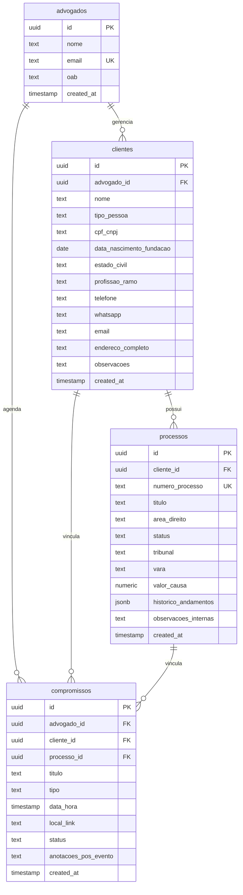

# Documentação do Banco de Dados - JT Advocacia

Esta documentação detalha a estrutura de banco de dados criada para o sistema de **Gestão Jurídica JT Advocacia** no Supabase. O banco foi estruturado para garantir integridade referencial, conformidade com as regras da OAB e do CNJ, além de segurança avançada e isolamento completo de dados por meio de **Row Level Security (RLS)**.

---

## Diagrama de Entidade-Relacionamento (ERD)

O diagrama abaixo ilustra os relacionamentos entre as tabelas criadas no banco de dados.



---

## Dicionário de Dados e Tabelas

### 1. Tabela `advogados`
Armazena as informações dos advogados cadastrados no sistema.

* **Row Level Security (RLS):** Ativo. Cada advogado tem acesso completo apenas ao seu próprio registro de perfil.

| Campo | Tipo | Restrições / Padrão | Descrição |
| :--- | :--- | :--- | :--- |
| `id` | `uuid` | `PRIMARY KEY`, `DEFAULT gen_random_uuid()` | Identificador único do advogado. Pode ser associado ao ID do Supabase Auth (`auth.uid()`). |
| `nome` | `text` | `NOT NULL` | Nome completo do advogado (ex: "Janaina Tarabauca"). |
| `email` | `text` | `NOT NULL`, `UNIQUE` | E-mail corporativo ou pessoal de acesso. |
| `oab` | `text` | - | Número de inscrição da OAB seguido da UF correspondente (ex: "123456/SP"). |
| `created_at` | `timestamp with time zone` | `DEFAULT timezone('utc'::text, now()) NOT NULL` | Data e hora em que o registro foi criado. |

---

### 2. Tabela `clientes`
Contém as informações detalhadas dos clientes (Pessoas Físicas e Jurídicas).

* **Row Level Security (RLS):** Ativo. Um advogado só pode ver, cadastrar, atualizar ou remover clientes que estejam vinculados ao seu `advogado_id`.

| Campo | Tipo | Restrições / Padrão | Descrição |
| :--- | :--- | :--- | :--- |
| `id` | `uuid` | `PRIMARY KEY`, `DEFAULT gen_random_uuid()` | Identificador único do cliente. |
| `advogado_id` | `uuid` | `NOT NULL`, `FOREIGN KEY (advogados.id)` | Advogado responsável pelo cliente. Exclusão em cascata (`ON DELETE CASCADE`). |
| `nome` | `text` | `NOT NULL` | Nome completo do cliente ou Razão Social. |
| `tipo_pessoa` | `text` | `CHECK (tipo_pessoa IN ('PF', 'PJ'))` | Define o enquadramento de personalidade jurídica ('PF' para Pessoa Física, 'PJ' para Pessoa Jurídica). |
| `cpf_cnpj` | `text` | - | CPF (Pessoa Física) ou CNPJ (Pessoa Jurídica) do cliente. |
| `data_nascimento_fundacao` | `date` | - | Data de nascimento do cliente ou data de fundação da empresa. |
| `estado_civil` | `text` | - | Estado civil do cliente. |
| `profissao_ramo` | `text` | - | Profissão (PF) ou Ramo de Atuação / Objeto Social (PJ). |
| `telefone` | `text` | - | Telefone fixo ou comercial. |
| `whatsapp` | `text` | - | Telefone de contato para WhatsApp corporativo. |
| `email` | `text` | - | E-mail de contato do cliente. |
| `endereco_completo` | `text` | - | Logradouro, número, complemento, bairro, cidade, UF e CEP. |
| `observacoes` | `text` | - | Notas gerais ou histórico do cliente. |
| `created_at` | `timestamp with time zone` | `DEFAULT timezone('utc'::text, now()) NOT NULL` | Data e hora de criação do registro. |

---

### 3. Tabela `processos`
Guarda os detalhes de todas as ações judiciais, recursos e andamentos cadastrados.

* **Row Level Security (RLS):** Ativo. Um advogado só pode gerenciar processos associados a clientes que pertencem a ele (validação feita por meio de sub-query na tabela `clientes`).

| Campo | Tipo | Restrições / Padrão | Descrição |
| :--- | :--- | :--- | :--- |
| `id` | `uuid` | `PRIMARY KEY`, `DEFAULT gen_random_uuid()` | Identificador único do processo. |
| `cliente_id` | `uuid` | `NOT NULL`, `FOREIGN KEY (clientes.id)` | Cliente associado ao processo. Exclusão em cascata (`ON DELETE CASCADE`). |
| `numero_processo` | `text` | `UNIQUE NOT NULL` | Número único de identificação no padrão CNJ (Conselho Nacional de Justiça). |
| `titulo` | `text` | `NOT NULL` | Título abreviado da ação judicial (ex: "Ação Indenizatória contra Empresa X"). |
| `area_direito` | `text` | - | Ramo do direito (ex: Civil, Trabalhista, Previdenciário, Penal, Tributário). |
| `status` | `text` | - | Status operacional do processo (ex: Ativo, Suspenso, Arquivado, Em Acordo). |
| `tribunal` | `text` | - | Tribunal onde tramita o processo (ex: TJSP, TRT2, JFSP, STJ). |
| `vara` | `text` | - | Órgão julgador do processo (ex: "2ª Vara Cível", "14ª Vara do Trabalho"). |
| `valor_causa` | `numeric` | - | Valor pecuniário atribuído à causa judicial. |
| `historico_andamentos` | `jsonb` | `DEFAULT '[]'::jsonb NOT NULL` | Estrutura JSON flexível para salvar a linha do tempo de andamentos, movimentações e atualizações do processo. |
| `observacoes_internas` | `text` | - | Anotações confidenciais do advogado sobre o processo. |
| `created_at` | `timestamp with time zone` | `DEFAULT timezone('utc'::text, now()) NOT NULL` | Data e hora de inclusão do processo no sistema. |

---

### 4. Tabela `compromissos`
Armazena a agenda de audiências, prazos, reuniões e consultas dos advogados.

* **Row Level Security (RLS):** Ativo. Cada advogado gerencia apenas os seus próprios compromissos (onde `advogado_id = auth.uid()`).

| Campo | Tipo | Restrições / Padrão | Descrição |
| :--- | :--- | :--- | :--- |
| `id` | `uuid` | `PRIMARY KEY`, `DEFAULT gen_random_uuid()` | Identificador único do compromisso. |
| `advogado_id` | `uuid` | `NOT NULL`, `FOREIGN KEY (advogados.id)` | Advogado vinculado ao compromisso. Exclusão em cascata (`ON DELETE CASCADE`). |
| `cliente_id` | `uuid` | `FOREIGN KEY (clientes.id) NULL` | Cliente opcional associado ao compromisso. Exclusão definida como nula se deletado (`ON DELETE SET NULL`). |
| `processo_id` | `uuid` | `FOREIGN KEY (processos.id) NULL` | Processo opcional associado. Exclusão definida como nula se deletado (`ON DELETE SET NULL`). |
| `titulo` | `text` | `NOT NULL` | Título curto do compromisso (ex: "Audiência de Conciliação"). |
| `tipo` | `text` | `NOT NULL` | Natureza do compromisso (ex: Audiência, Reunião, Prazo Processual, Atendimento). |
| `data_hora` | `timestamp with time zone` | `NOT NULL` | Data e horário agendados (com fuso horário). |
| `local_link` | `text` | - | Localização física da reunião/foro ou link da videochamada (Teams, Zoom, Google Meet). |
| `status` | `text` | - | Situação atual do compromisso (ex: Agendado, Realizado, Cancelado). |
| `anotacoes_pos_evento` | `text` | - | Relatório resumido ou ata escrita após a realização do compromisso. |
| `created_at` | `timestamp with time zone` | `DEFAULT timezone('utc'::text, now()) NOT NULL` | Data e hora de criação do registro de agenda. |

---

## Políticas do Row Level Security (RLS)

O Supabase aplica as seguintes regras de segurança para cada requisição efetuada, usando a função `auth.uid()` para obter a identidade do advogado logado.

### Políticas da Tabela `advogados`
* **Leitura, Cadastro, Atualização e Deleção:** O advogado só pode manipular registros onde o `id` da tabela corresponder ao seu ID de autenticação.
  ```sql
  auth.uid() = id
  ```

### Políticas da Tabela `clientes`
* **Leitura, Cadastro, Atualização e Deleção:** A manipulação dos dados só é permitida se o `advogado_id` do registro corresponder ao ID de autenticação.
  ```sql
  auth.uid() = advogado_id
  ```

### Políticas da Tabela `processos`
* **Leitura, Cadastro, Atualização e Deleção:** Apenas advogados que possuam o cliente responsável pelo processo podem interagir com as informações. Isso é validado por uma verificação de existência (`EXISTS`):
  ```sql
  EXISTS (
      SELECT 1 FROM public.clientes
      WHERE clientes.id = processos.cliente_id
        AND clientes.advogado_id = auth.uid()
  )
  ```

### Políticas da Tabela `compromissos`
* **Leitura, Cadastro, Atualização e Deleção:** O advogado só pode visualizar e modificar registros de compromissos vinculados diretamente ao seu próprio `advogado_id`.
  ```sql
  auth.uid() = advogado_id
  ```

---

> [!TIP]
> **Recomendação de Integração:** Ao cadastrar novos usuários (advogados) utilizando o Supabase Auth, você pode implementar um trigger no PostgreSQL na tabela `auth.users` para inserir automaticamente o perfil na tabela `public.advogados`. Isso garante a sincronização instantânea das informações de login com o perfil operacional do sistema de advocacia.
